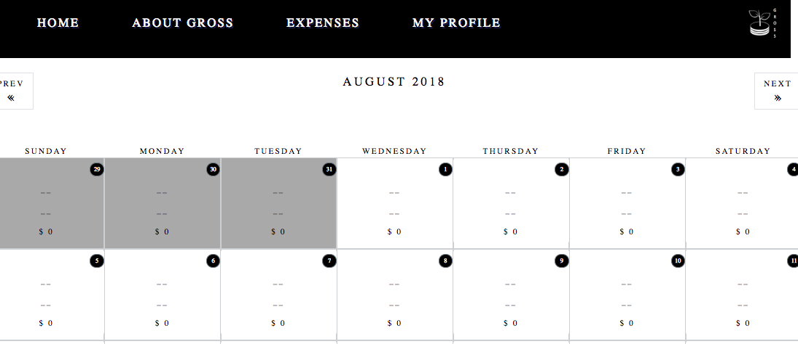
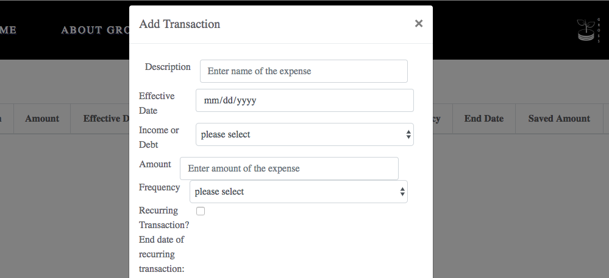
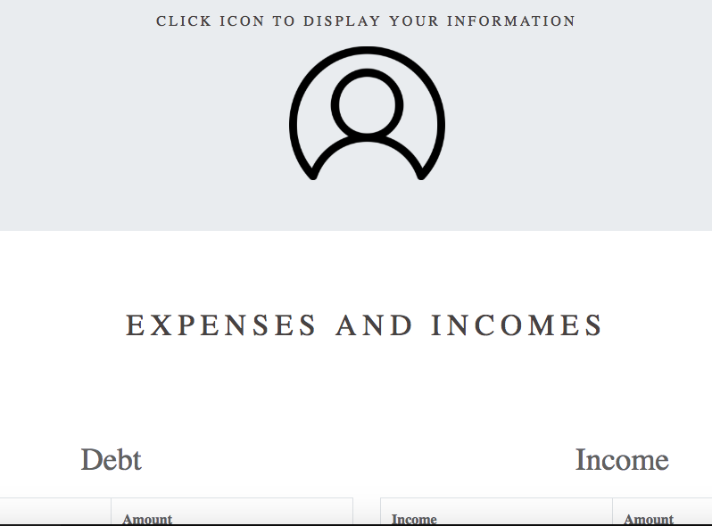

Gro$$ Financial Tracker
Gro$$ is a responsive web application comprised of a PERN stack (Postgres, Express, React, & NodeJS) that allows you to track debt, income and savings goals. It also incorporates both Google Strategy and Facebook Strategy as an additional authentication feature.

Login
The login page allows the users to log into the app using either their Facebook or Google accounts for authentication.

CalendarPage
The calendar page allows the user to view their transactions by month in order to be aware of what funds are coming in and going out. 

ExpensesPage
The expenses page allows the users to add transactions, whether income, debt, one-time or recurring. The transactions are then shown in a table and also pushed to the calendar for that user's account

UserPage
The userpage will allow users to see their own personal profile as well as their overall income and debt totals. Additionally, the user will see a progress bar of their savings goals. 

About Gross
The about us page allows users to see the authors of the site and get a glimpse of our specialties and personalities.

Additional Information
Installation
Please install the following packages
Axios, React, React-Bootstrap, React-Coverflow, React-Dom, React-Router-Dom,  Bcrypt, Cookie-Parser, Dotenv, Express, Express-Session, HBS, HTTP-Errors, Logger, LS, Morgan, Nodemailer, Nodemon, Passport, Passport-Google-OAuth, Passport-Facebook, Path, PG, React-Router, Sequelize, Sequelize-CLI

Authors
Kamilah Kassim - kamikassim
Carly Harper - carlyharper
David Eduoard - DEdouard22
Gabriel Eduoard - edgabriel92

License
This project is licensed under the MIT License.

Acknowledgments
Our instructors, Adam Szaruga and Lachlan Haywood, at DigitalCrafts
Create-React-App Developers at Facebook